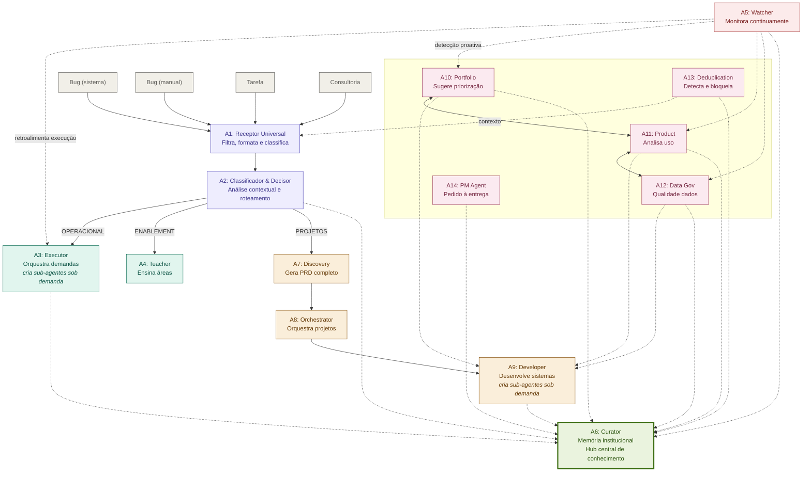

# Fluxo Agêntico diagram — 14 agents

An SVG architecture diagram, titled **"Fluxo Agêntico - 14 Agentes"**, delivered
as a self-contained HTML page. The design artifact behind [[Agent Flow]] — the
thing the 2026-08-10 onboarding described verbally.

> [!warning] Date is unknown
> The file carries no internal date and the filename none either. Filesystem
> timestamp is 2026-08-17, but that's when msilva downloaded it *(unverified:
> from file mtime, may be the download date)*. The design was already being
> discussed on 2026-08-10, so the content predates that.

> [!note] It's a revision
> Filename says *ajustado* (adjusted) and `(2)`. The HTML comments preserve an
> **older numbering** that no longer matches the rendered labels — e.g. the
> comment `A10: Project Orchestrator` renders as **A8: Orchestrator**, and
> `A8: CURATOR` renders as **A6: Curator**. So the agents were renumbered at
> least once. The rendered labels are authoritative; A1–A14 are all present with
> no gaps.

## The flow

**Four entry channels** converge on a single receptor: `Bug (sistema)` ·
`Bug (manual)` · `Tarefa` · `Consultoria`.

Rendered from the raw SVG's actual node coordinates and edges (not just the
verbal description) — colors match the original's grouping: purple = intake,
teal = operational/enablement, orange = projects pipeline, red = monitoring,
pink = transversal intelligences, green = A6's memory hub. Dashed edges are
the diagram's own "context feeding" lines; solid edges are its main flow.

**Legend, verbatim from the diagram**: solid lines = main flow, dotted lines
= context feeding. A6 Curator's edges to every other agent are all faint
dashed lines in the original (opacity ~0.1) — rendered above as regular
dashed edges for legibility, since Mermaid can't reproduce that low an
opacity distinctly.

| Agent | Role | Note |
|---|---|---|
| **A1** Receptor Universal | Filters, formats, classifies | Single front door for all four channels |
| **A2** Classificador & Decisor | Contextual analysis and routing | Decides which of the three branches |
| **A3** Executor | Orchestrates demands | *Creates sub-agents on demand.* Labelled "demandas rápidas" |
| **A4** Teacher | Teaches areas | The enablement branch, a single agent |
| **A5** Watcher | Monitors continuously | "Detecção proativa" — see below |
| **A6** Curator | Institutional memory, central knowledge hub | See below |
| **A7** Discovery | **Generates a complete PRD** | "Novos sistemas" |
| **A8** Orchestrator | Orchestrates projects | |
| **A9** Developer | Develops systems | *Creates sub-agents on demand* |
| **A10** Portfolio | Suggests prioritization | Transversal |
| **A11** Product | Analyses usage | Transversal |
| **A12** Data Gov | Data quality | Transversal |
| **A13** Deduplication | **Detects and blocks** | Transversal; feeds context back to A1 |
| **A14** PM Agent | Request through to delivery | Transversal |

Legend, verbatim from the diagram: **solid lines = main flow, dotted lines =
context feeding**.

## Four things the diagram says that the transcript didn't

**1. A6 Curator is the architectural centre, not one agent among many.**
It sits in its own section — `MEMÓRIA & APRENDIZADO` — is drawn with a
noticeably heavier border than every other node, and *every* other agent
connects to it. [[Agent Flow]] previously recorded institutional memory as one
of six transversal agents. It isn't: it's the hub the whole system feeds.

That matters because the **`Brain` repository already does this job**
([[2026-08-14 Papo de Projetos]]). The overlap isn't with a peripheral component,
it's with the centrepiece.

**2. A5 Watcher is not a transversal intelligence.** It's a separate concern with
two distinct outputs: a **direct feedback loop into A3 Executor**
(*"retroalimenta execução"*) and dotted context lines into the transversal
agents. Monitoring drives execution rather than merely reporting — a stronger
claim than the wiki had.

**3. A13 Deduplication "detecta e bloqueia" — it blocks.** Not advisory. It is a
gate that can stop work, and it feeds context back into A1 so the receptor knows
what already exists. That is the strongest enforcement anywhere in the diagram.

**4. `Bug (sistema)` is a machine-generated entry channel.** Distinguished from
`Bug (manual)`. Nothing says what emits it — but the [[Airtable Proxy]] produces
exactly this kind of signal, and A5 Watcher is the obvious other candidate.

## Open questions

Mostly resolved by [[Fluxo Agêntico project instruction]], which arrived after
this page was written:

- ~~**What feeds `Bug (sistema)`?**~~ **Resolved** — A1 ingests *"alertas de
  sistemas"* as a first-class channel, alongside Slack, Monday, email, forms and
  webhooks. The [[Airtable Proxy]]'s alerting is a candidate producer.
- ~~**The dotted lines from the transversal agents**~~ **Resolved** — the
  authoritative connection list says **A10, A11, A12 → A9**, consulted before
  project decisions. The geometry reading was right and the stale comment wrong.
- ~~**What does A13 block?**~~ **Partly resolved** — it blocks duplicated work
  before it enters the flow. Also worth noting **A12 hard-blocks too**
  (unauthorized external APIs, critical compliance exports, whole-base deletes),
  so A13 is not the only gate — correcting the claim made earlier on this page.
- **Who authored it, and when?** The instruction is credited to "Gabi"; the
  diagram itself records no author. Date still unresolved.

> [!warning] Correction — the "Pedro co-designed it" claim doesn't check out
> This section previously said *"Pedro (the departed developer) co-designed the
> architecture per [[2026-08-10 Onboarding Técnico - Matheus]]"*. That meeting
> page, as it stands, names no Pedro and no departed developer at all — the
> citation doesn't support the claim. Found while building out `people/` pages
> and refusing to fabricate a "Pedro (departed developer)" entry on unverifiable
> grounds. Removed rather than kept; if the fact is real it came from somewhere
> else (a raw file not yet re-checked, or a conflation with
> [[Gabriel (matriz de eventos, departed)]]). Re-verify against `raw/` before
> restoring it.
- **Why the renumbering?** Still open. Knowing what was merged, split, or reordered
  would indicate which parts are settled.
